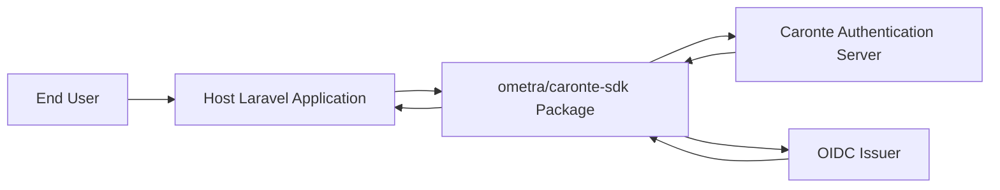
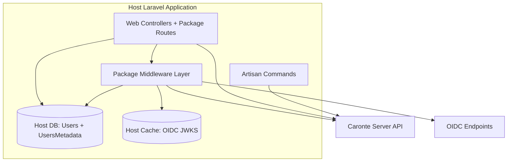
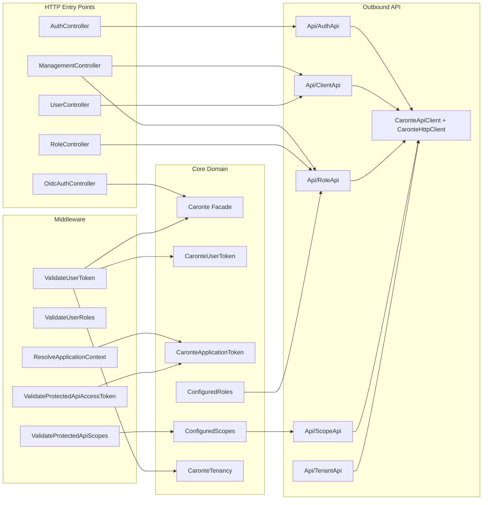

# Architecture Diagrams

## System Context Diagram

## Container Diagram

## Component Diagram

## Notes

- This is a package-level architecture view; host app architecture is intentionally not modeled in detail.
- Deprecated compatibility components (permission aliases and legacy middleware aliases) remain present and should be considered in migration planning.
