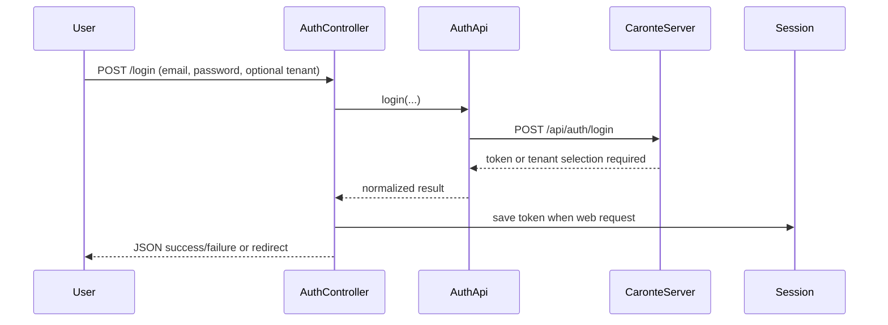
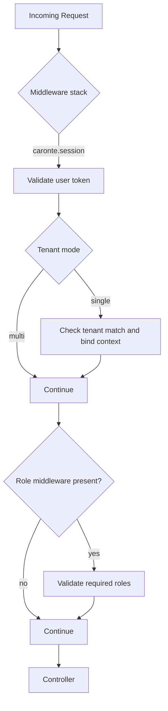
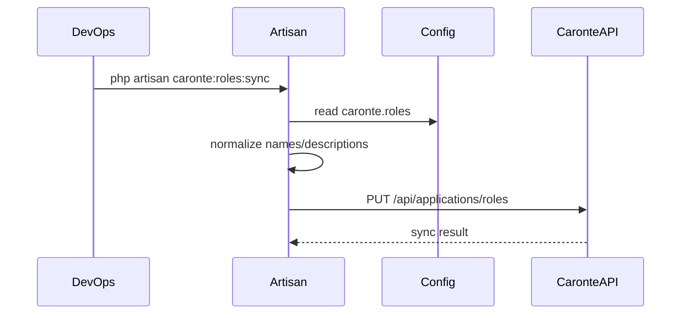

# Business Logic & Core Processes

## 1. Domain Summary

Core business purpose: delegate authentication and authorization to Caronte while exposing Laravel-native middleware, routes, and management flows for host applications.

Primary domains:

- User authentication and session handling
- Stateless client authentication endpoints for public consumers
- Tenant-aware access control
- Role and protected scope synchronization
- Management UI for user lifecycle and assignments
- App-to-app trust for internal service calls

## 2. Core Process: User Login and Session Establishment

Why it exists:

- Host apps need a standardized login flow backed by Caronte-issued JWTs.

Main components:

- Ometra\Caronte\Http\Controllers\AuthController (src/Http/Controllers/AuthController.php)
- Ometra\Caronte\Api\AuthApi (src/Api/AuthApi.php)
- Ometra\Caronte\CaronteUserToken (src/CaronteUserToken.php)
- Ometra\Caronte\Facades\Caronte (src/Facades/Caronte.php)

Flow:

1. Client posts credentials to package login route.
2. AuthController validates request and invokes AuthApi::login.
3. Caronte returns token or conflict (tenant selection required).
4. Token is validated and saved in session for web requests.
5. User is redirected/returned with standardized response envelope.

Business rules:

- Single-tenant mode rejects explicit tenant mismatches.
- Pending login state has TTL for tenant selection continuation.
- JSON/API clients receive response envelope instead of redirects.
- API clients do not persist Laravel session state and should replace stored bearer tokens from `X-User-Token` when middleware refreshes a credential.

## 3. Core Process: Request Authorization via Middleware

Why it exists:

- Every protected request must validate identity, tenant, and privileges.

Main components:

- ValidateUserToken (src/Http/Middleware/ValidateUserToken.php)
- ValidateUserRoles (src/Http/Middleware/ValidateUserRoles.php)
- ResolveApplicationContext (src/Http/Middleware/ResolveApplicationContext.php)
- ValidateProtectedApiAccessToken (src/Http/Middleware/ValidateProtectedApiAccessToken.php)
- ValidateProtectedApiScopes (src/Http/Middleware/ValidateProtectedApiScopes.php)

Flow variants:

- User session flow: caronte.session then optional caronte.roles.
- App-to-app flow: caronte.application with optional tenant_required/user_required.
- Protected API flow: caronte.protected-api-token then caronte.protected-api-scopes.

Business rules:

- If user token was exchanged and request expects JSON, response includes X-User-Token.
- Middleware caches the validated token on the request so downstream auth flows reuse the same credential instance.
- Single-tenant mode binds tenant context and enforces tenant match.
- Scope checks are strict for required middleware parameters.

## 4. Core Process: Role and Scope Synchronization

Why it exists:

- Caronte must know app-defined roles/scopes for consistent access control.

Main components:

- ConfiguredRoles (src/Support/ConfiguredRoles.php)
- ConfiguredScopes (src/Support/ConfiguredScopes.php)
- SyncRoles command (src/Console/Commands/Roles/SyncRoles.php)
- SyncScopes command (src/Console/Commands/ProtectedApi/SyncScopes.php)
- RoleApi and ScopeApi

Flow:

1. Normalize role/scope definitions from config/caronte.php.
2. Optionally run dry-run for preview.
3. PUT normalized payload to Caronte endpoints.
4. Management UI also previews remote mismatch state for roles.

Business rules:

- Role names: lowercase normalization; allowed chars include letters, numbers, dot, underscore, hyphen.
- root role is always present after normalization.
- Legacy permissions alias maps to scopes and is deprecated.

## 5. Core Process: Management UI User Lifecycle

Why it exists:

- Provide package-native administration for users linked to the host app.

Main components:

- ManagementController
- UserController
- RoleController
- ClientApi

Flow:

1. Authorized manager opens dashboard.
2. Dashboard fetches users and role sync preview.
3. Admin can create/update/delete users and synchronize role assignments.
4. Optional metadata operations are available when feature flag is enabled.

Key constraints:

- Role creation/update/delete via UI are deprecated; source of truth is config/caronte.php + sync.
- Metadata endpoints are gated by caronte.management.features.metadata.

## 6. Secondary Process: OIDC Authentication Mode

Why it exists:

- Allow standards-based auth with issuer endpoints where configured.

Main components:

- OidcAuthController
- OidcClient
- OidcTokenValidator
- OIDC support classes in src/Oidc

Rules:

- state and PKCE verifier are persisted in session for callback validation.
- ID token validation is required before session token persistence.
- OIDC refresh token is stored in session when provided.

## 7. Assumptions and Unknowns

- Downstream Caronte API error payload variability is outside this package contract.
- Business semantics of some Caronte tenant and scope rules are server-defined.

See doc/open-questions-and-assumptions.md.
