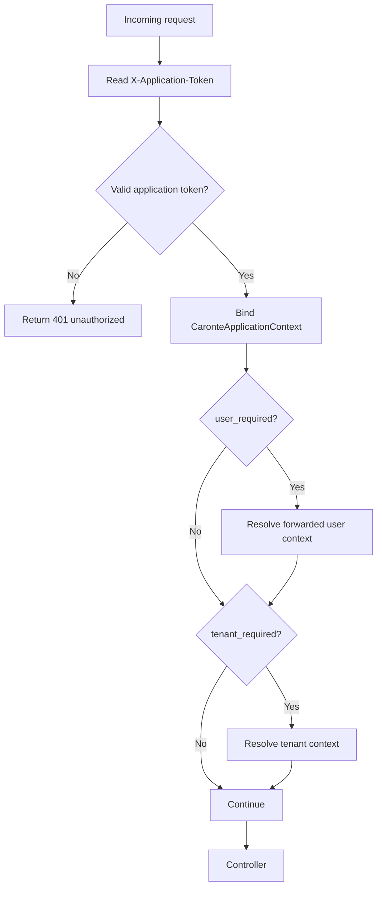

# caronte.application

Class: Ometra\Caronte\Http\Middleware\ResolveApplicationContext

## Purpose

- Authenticate internal service-to-service requests using application tokens.
- Optionally require tenant context and/or a forwarded user context.
- Bind application context objects into the container for downstream code.

## Supported modes

- `tenant_required`
- `user_required`

Examples:

- `caronte.application`
- `caronte.application:tenant_required`
- `caronte.application:user_required`
- `caronte.application:tenant_required,user_required`

## Step-by-step flow

1. The middleware reads `X-Application-Token`.
2. The application token is validated and converted into a `CaronteApplicationContext`.
3. The context is bound into the service container.
4. If `X-Group-Token` is present and the application group is configured, grouped application validation is performed by the token resolver.
5. If `user_required` is enabled, the middleware resolves a forwarded user context.
6. If `tenant_required` is enabled, the middleware resolves tenant context and can reject the request if tenant resolution fails.
7. On success, the controller receives the bound application and optionally user and tenant contexts.

## Flow diagram

## Typical failures

- `401 No application token provided`.
- `401 Invalid application token signature or issuer`.
- `401 Application token does not match configured application`.
- `401 Group token missing or invalid when a group token is expected`.
- Tenant resolution failures when `tenant_required` is enabled.

## Debugging tips

- Confirm `X-Application-Token` is present and not a legacy base64 token.
- If group mode is active, confirm `X-Group-Token` is also sent.
- Check `config(caronte.app_cn)`, `config(caronte.app_secret)`, and group settings.
- For `tenant_required` routes, confirm `X-Tenant-Id` or forwarded user tenant data exists.
- Inspect the bound container instances: `CaronteApplicationContext` and, when present, `CaronteForwardedUserContext`.