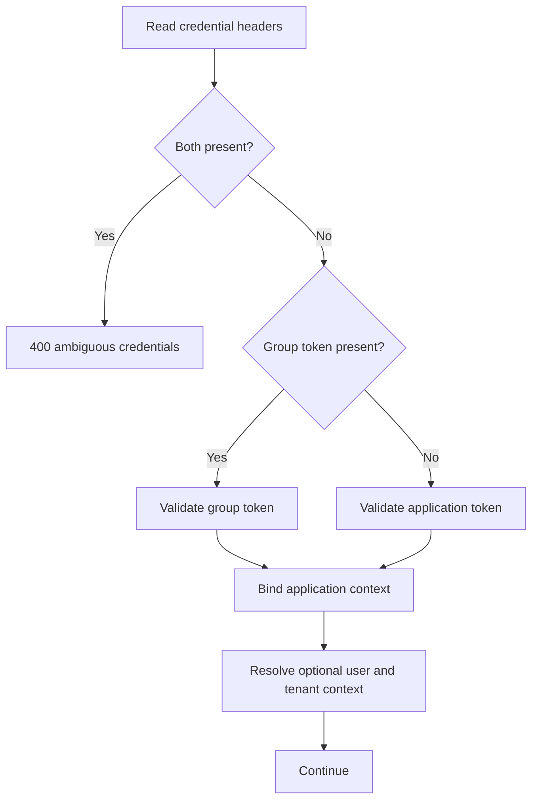

# caronte.application

Class: `Ometra\Caronte\Http\Middleware\ResolveApplicationContext`

## Purpose

- Authenticate internal service requests with one application-level credential.
- Optionally require tenant and/or forwarded-user context.
- Bind `CaronteApplicationContext` for downstream code.

## Credential contract

- Applications without a configured group send only `X-Application-Token`.
- Applications with a configured group send only `X-Group-Token`.
- Requests containing both headers are rejected with `400 Ambiguous application credentials`.
- Missing or invalid credentials return `401`.

An individual token is validated against the configured application id, canonical name, secret, issuer, audience, and temporal claims. A group token is validated against the configured group id and secret and must contain `source_app_id` and `source_app_cn`.

The source claims provide operational attribution with integrity at group-secret level. Because the secret is shared, they do not provide non-repudiation between group members.

## Supported modes

- `tenant_required`
- `user_required`

Examples:

- `caronte.application`
- `caronte.application:tenant_required`
- `caronte.application:user_required`
- `caronte.application:tenant_required,user_required`

## Flow

In grouped context, `applicationToken` and `applicationTokenId` are `null`; `groupTokenId`, `sourceAppId`, and `sourceAppCn` come from the validated group token.
