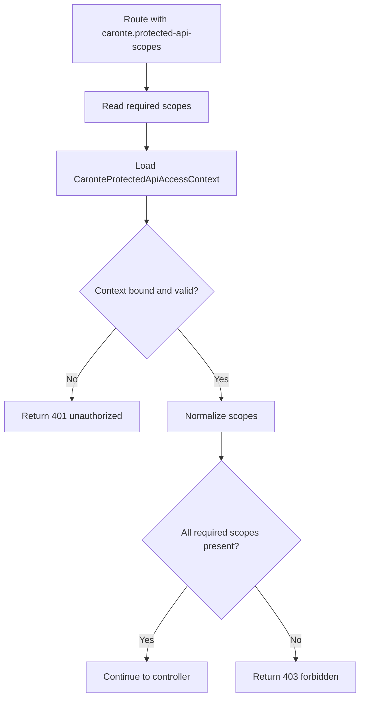

# caronte.protected-api-scopes

Class: Ometra\Caronte\Http\Middleware\ValidateProtectedApiScopes

## Purpose

- Enforce required scopes on a request that already has a valid protected API access token.

## Step-by-step flow

1. The middleware reads the required scope list from route parameters.
2. It retrieves the bound `CaronteProtectedApiAccessContext` from the container.
3. Each required scope is normalized to lowercase and trimmed.
4. The context is checked for all required scopes.
5. If any scope is missing, the middleware returns `403`.
6. Otherwise the request continues.

## Flow diagram

## Typical failures

- `401 Context missing because caronte.protected-api-token did not run first`.
- `403 Protected API Access Token does not have the required scopes`.

## Debugging tips

- Always place `caronte.protected-api-token` before `caronte.protected-api-scopes`.
- Check the scopes embedded in the token versus the route requirements.
- Confirm the scope names are normalized consistently in config and route definitions.