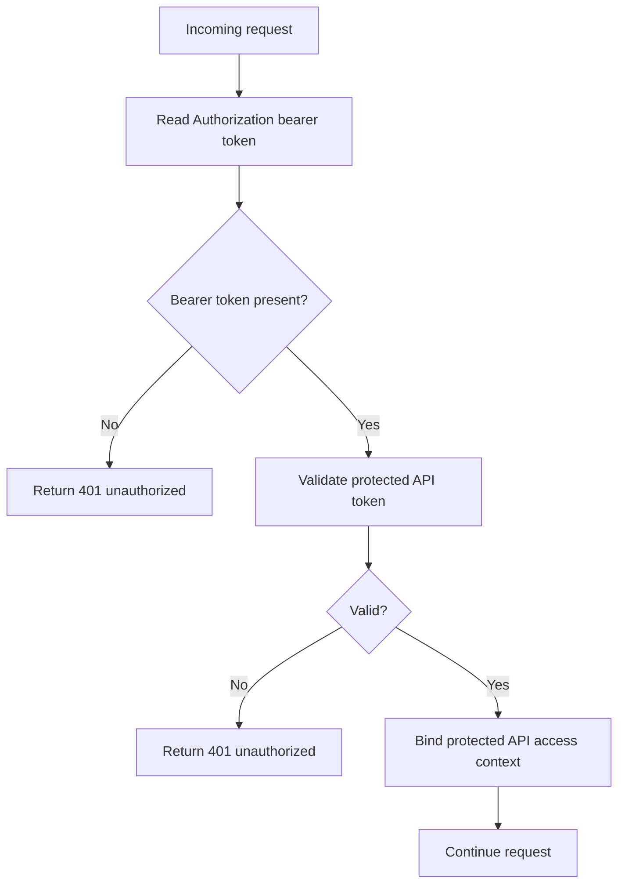

# caronte.protected-api-token

Class: Ometra\Caronte\Http\Middleware\ValidateProtectedApiAccessToken

## Purpose

- Validate bearer tokens intended for external clients consuming the host app API.
- Bind a protected API access context for downstream scope checks and controllers.

## Step-by-step flow

1. The middleware reads the `Authorization` bearer token.
2. The token is parsed and validated as a protected API access token.
3. The resulting context is stored in the container as `CaronteProtectedApiAccessContext`.
4. The request continues to the next middleware or controller.

## Flow diagram

## Typical failures

- `401 Token not provided or malformed`.
- `401 Invalid audience`.
- `401 Invalid signature or issuer`.
- `401 Expired token`.
- `401 Token missing required claims`.

## Debugging tips

- Verify the client is sending a JWT in `Authorization: Bearer`.
- Confirm the token audience claim is `protected_api_access`.
- Confirm the token is signed with the host app's `CARONTE_APP_SECRET`.
- Confirm the token issuer matches `config(caronte.issuer_id)`.
