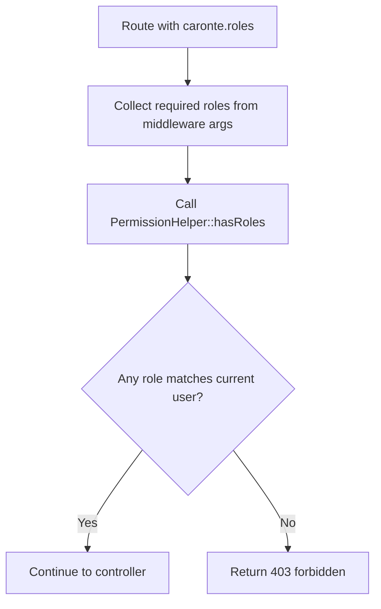

# caronte.roles

Class: Ometra\Caronte\Http\Middleware\ValidateUserRoles

## Purpose

- Allow a request only when the authenticated user has at least one of the required roles.
- The `root` role is always treated as an implicit role in the permission helper logic.

## Step-by-step flow

1. The middleware receives a comma-separated list of required role names from the route definition.
2. `PermissionHelper::hasRoles()` is called with the required roles.
3. The permission helper checks the current user token payload.
4. The helper compares the current user's roles against the required list.
5. If no role matches, a `403` response is returned.
6. Otherwise the request continues.

## Flow diagram

## Typical failures

- `403 User does not have the required roles`: the route requires roles the current user does not have.
- `401 Unauthorized response`: the middleware could not read a valid user token first.

## Debugging tips

- Confirm the route is protected by `caronte.session` before `caronte.roles`.
- Inspect `config(caronte.management.access_roles)` if the route is part of the management UI.
- Verify the user's roles from the JWT payload, not just the display name in the UI.
- Ensure the configured role names match normalized names from `config/caronte.php`.