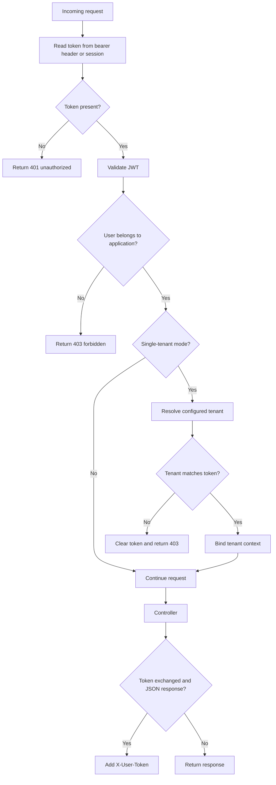

# caronte.session

Class: Ometra\Caronte\Http\Middleware\ValidateUserToken

## Purpose

- Validate the current user JWT.
- Enforce application membership.
- Enforce tenant constraints when running in single-tenant mode.
- Return refreshed user token data in `X-User-Token` when the token layer exchanges credentials during a JSON/API response.

User JWTs must contain `iss`, `aud`, `sub`, `jti`, `iat`, `nbf`, `exp`, `token_audience`, and `id_tenant`. The `id_tenant` claim may be explicitly `null` for a global user, but it may not be omitted. Application tokens use `token_audience=application`; group user tokens use `token_audience=application_group` and must include matching `group_id`, `app_id`, and `source_app_id` claims.

## Step-by-step flow

1. The middleware calls `Ometra\Caronte\Facades\Caronte::getToken()`.
2. The token is loaded from the request context.
3. Bearer tokens are used for API requests and session tokens are used for web requests.
4. The token is validated by the user token validator. Refreshed web-route tokens are persisted in the session, regardless of the requested response format.
5. The middleware checks whether the user belongs to the current application.
6. If the package is in single-tenant mode, the configured tenant id is compared with the token tenant.
7. When the tenant matches, tenant context is bound for the request lifecycle.
8. The downstream controller executes.
9. If the token was exchanged and the response is JSON or API-like, the middleware adds `X-User-Token` to the response headers.

## Flow diagram

## Typical failures

- `401 Token not found`: no session token or bearer token was provided.
- `401 Invalid/expired token`: JWT validation failed.
- `403 User does not have access to this application`: application membership check failed.
- `403 Tenant mismatch`: the configured single-tenant id differs from the token tenant.
- `403 Tenant is required for this application`: the token has no tenant and single-tenant mode requires one.

## Debugging tips

- Inspect the inbound request token source. Web routes use session; API routes use `Authorization`.
- Web routes that request JSON still persist refreshed tokens in the Laravel session.
- Confirm `config(caronte.tenancy.mode)` and `config(caronte.tenancy.id_tenant)`.
- Check the user token claims for `id_tenant`, `app_id`, and roles.
- If an API client expects token refresh, verify it reads `X-User-Token` from the response.
